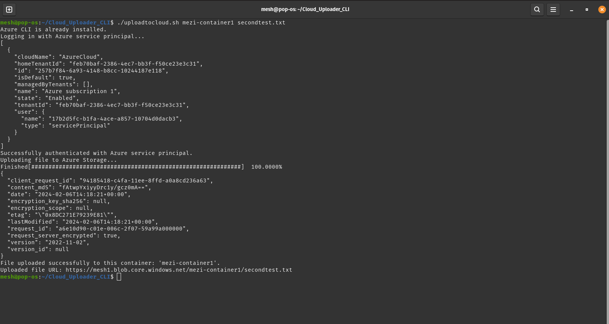

**Cloud Uploader CLI Tool**

This Bash script facilitates the uploading of files to Azure Storage by leveraging the Azure CLI. Below are detailed instructions on how to use the script, along with prerequisites that must be met before running it.

### Prerequisites

Before using this script, ensure that you have the following:

1. **Azure Account**: You must have an active Azure account. If you don't have one, sign up [here](https://azure.microsoft.com/en-us/free/).

2. **Azure CLI Tool**: The Azure CLI tool must be installed and set up on your system. Instructions for installation can be found [here](https://docs.microsoft.com/en-us/cli/azure/install-azure-cli). Note that this script was developed and tested on a Debian-based Linux distribution, specifically Pop!_OS, which is based on Ubuntu. Users on similar systems should ensure compatibility by reviewing the `install_azure_CLI` function in the script.

3. **Storage Account and Container**: You should have created an Azure Storage account and a container within it. If not, follow [these instructions](https://docs.microsoft.com/en-us/azure/storage/common/storage-account-create?tabs=azure-portal).

4. **Service Principal with Correct RBAC**: Create a service principal with the appropriate role-based access control (RBAC) permissions. The principal should have password-based access for login. Instructions for creating a service principal and assigning roles can be found [here](https://docs.microsoft.com/en-us/azure/active-directory/develop/howto-create-service-principal-portal).

### Usage

To use the Cloud Uploader CLI Tool, follow these steps:

1. **Download the Script**: Download the Bash script (`cloud_uploader.sh`) to your local machine.Make sure its excecutable.

2. **Set Environment Variables**: Set the following environment variables with the values for your Azure service principal:

   - `SP_APP_ID`: The application (client) ID of your service principal.
   - `SP_TENANT_ID`: The ID of your Azure AD tenant.
   - `SP_PASSWORD`: The password or client secret associated with your service principal.

3. **Run the Script**: Execute the script from the terminal with the following command:

   ```bash
   ./cloud_uploader.sh <container_name> <file_path>
   ```

   Replace `<container_name>` with the name of your Azure Storage container and `<file_path>` with the path to the file you want to upload.

### Sample Output

Here is a successful test i performed on my machinen and the script worked as expected.


### Making the Script Globally Available

To make the Cloud Uploader CLI Tool script globally available on your Linux system, follow these steps:

1. **Ensure the Script is Executable**:
   Before proceeding, ensure that the script (`cloud_uploader.sh`) is executable. If it's not already executable, you can make it executable using the following command:
   ```bash
   chmod +x cloud_uploader.sh
   ```

2. **Move the Script to a Directory in the System's PATH**:
   To make the script globally available, you need to move it to a directory that is included in your system's PATH. Common directories where user scripts are placed include `/usr/local/bin` or `~/bin` (if it exists and is in your PATH).

   For example, you can move the script to `/usr/local/bin` using the following command (you may need root privileges):
   ```bash
   sudo mv cloud_uploader.sh /usr/local/bin
   ```

3. **Verify Accessibility**:
   After moving the script, verify that it is accessible from any directory by typing its name without specifying the path. Open a new terminal session and try running the script:
   ```bash
   cloud_uploader.sh <container_name> <file_path>
   ```

   If the script runs successfully, it means it is globally available.

By following these steps, you can make your script globally available on your Linux system, allowing you to execute it from any directory without specifying its full path.

### Note

- This script has been developed and tested on a Debian-based Linux distribution (Pop!_OS), specifically using the `apt` package manager. Users on similar systems should ensure compatibility and review the `install_azure_CLI` function in the script for any necessary adjustments.

- If you encounter any issues or have questions about using the script, refer to the comments within the script or consult the Azure CLI documentation for further assistance.

- For additional help or support, you can visit the [Azure Documentation](https://docs.microsoft.com/en-us/azure/) or the [Azure CLI GitHub repository](https://github.com/Azure/azure-cli).